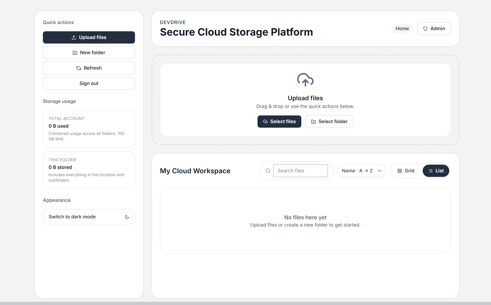

# DevDrive · Personal Cloud Storage

DevDrive is a secure cloud storage platform that stores files in a private AWS S3 bucket using pre-signed URLs only. The backend manages user accounts in MongoDB, enforces MFA via TOTP, and scopes every file operation to a per-user S3 prefix, while the React + Vite frontend delivers a polished drive-like experience.

---

## ✨ Highlights

- **Zero-trust frontend** – No AWS credentials in the browser. Every operation flows through the backend.
- **Multi-user auth** – MongoDB-backed accounts with bcrypt hashing, QR-based TOTP enrollment, and per-user S3 roots for data isolation.
- **Secure Express API** – Input validation, rate limiting, helmet, strict CORS, and S3 pre-signed URLs for uploads/downloads.
- **Email-first onboarding** – Usernames are verified email addresses; registrations require a 6-digit OTP (2-minute expiry) with a 90-second resend cooldown before MFA enrollment.
- **Recursive storage usage** – The API sums every object inside a folder (including nested subfolders) so the UI can show the actual bytes stored.
- **Modern UI/UX** – Responsive dashboard, drag-and-drop uploads, grid/list views, hover actions, context menus, preview modals, toasts, dark mode, and keyboard shortcuts.
- **S3-native features** – Create folders, move/rename items, delete recursively, generate download links, and preview common file types.
- **Admin approvals & quotas** – Designate admins who approve new accounts, set storage quotas per user, and trigger notification emails via SMTP.

---

## 🗂️ Repository Layout

```
devdrive/
├── backend/        # Express API + AWS SDK v3
└── frontend/       # React + Vite + Tailwind UI
```

---

## 🚀 Quick Start

### 1. Backend API

```bash
cd backend
npm install
cp .env .env.local # optional backup
npm run dev
```

The server listens on `PORT` (default `5000`). Make sure `MONGODB_URI` points to a reachable MongoDB deployment (Atlas or local `mongod`) before starting the API.

### 2. Frontend App

```bash
cd frontend
npm install
npm run dev
```

The Vite dev server defaults to `http://localhost:5173`.

### 3. Create your first user

1. Visit the frontend in your browser and click **Create one** under the login form.
2. Enter your email + password. DevDrive emails a 6-digit verification code (valid for 2 minutes); enter it to continue (or request a fresh code after 90 seconds). If SMTP isn’t configured yet, the backend logs the OTP to the console so you can keep testing locally.
3. Scan the QR code with an authenticator app (Authy, 1Password, Google Authenticator, etc.).
4. Enter the 6-digit TOTP code to finalize registration. The UI will automatically sign you in and create your private S3 prefix (`users/<mongoId>/`).

### 4. Admin approval (optional)

If you leave approvals enabled (the default), new accounts stay in a **pending** state until an admin signs in and approves them:

1. Mark at least one username in `ADMIN_AUTO_APPROVE_USERS` so that account is auto-promoted to admin during registration.
2. When a new user finishes MFA, the backend emails `ADMIN_NOTIFICATION_EMAILS` (and logs to the server if SMTP is missing).
3. Admins can open the **Admin** button in the app header to review pending requests, set per-user quotas (in GB), and approve them.
4. Approved users receive an email (the username is treated as the contact email) and can immediately sign in.

> Tip: set `DEFAULT_USER_QUOTA_BYTES` to control the starting quota for everyone, then fine-tune per user inside the Admin panel.

---

## 🔐 Environment Variables

Create `backend/.env` with:

| Name                           | Description                                                                                                      |
| ------------------------------ | ---------------------------------------------------------------------------------------------------------------- |
| `MONGODB_URI`                  | MongoDB connection string (local `mongodb://localhost:27017/devdrive` or Atlas URI).                             |
| `PORT`                         | Express port (default `5000`).                                                                                   |
| `SESSION_SECRET`               | Random 32+ character secret for JWT/cookie signing.                                                              |
| `AWS_REGION`                   | AWS region of your S3 bucket (e.g., `ca-central-1`).                                                             |
| `AWS_ACCESS_KEY_ID`            | IAM access key **with limited S3 policy**.                                                                       |
| `AWS_SECRET_ACCESS_KEY`        | Matching secret key.                                                                                             |
| `S3_BUCKET`                    | **Private** bucket name dedicated to DevDrive.                                                                   |
| `FRONTEND_ORIGIN`              | Allowed origin for CORS, e.g., `http://localhost:5173`.                                                          |
| `ADMIN_AUTO_APPROVE_USERS`     | (Optional) Comma-separated usernames that should auto-provision as approved admins.                              |
| `ADMIN_NOTIFICATION_EMAILS`    | (Optional) Comma-separated emails to notify when a new user needs approval.                                      |
| `MAX_UPLOAD_BYTES`             | (Optional) Max upload size in bytes (default 100 MB).                                                            |
| `DEFAULT_USER_QUOTA_BYTES`     | (Optional) Default per-user quota in bytes (default 50 GiB).                                                     |
| `SESSION_ACCESS_TTL`           | (Optional) Access-token lifetime in seconds (default 86400 / 24 hours).                                          |
| `SESSION_REFRESH_TTL`          | (Optional) Refresh-token lifetime in seconds (default 604800 / 7 days).                                          |
| `HTTPS_ONLY_COOKIES`           | (Optional) Set to `true` to force `Secure` cookies outside production.                                           |
| `AUTH_ISSUER_NAME`             | (Optional) Label that appears in authenticator apps (default `DevDrive`).                                        |
| `MAIL_SMTP_HOST`               | (Optional) SMTP host for outbound email notifications.                                                           |
| `MAIL_SMTP_PORT`               | (Optional) SMTP port (default `587`).                                                                            |
| `MAIL_SMTP_SECURE`             | (Optional) Set to `true` to enforce TLS from the start (defaults to `true` when port `465`, otherwise STARTTLS). |
| `MAIL_SMTP_CONNECTION_TIMEOUT` | (Optional) SMTP connection timeout in ms (default `10000`).                                                      |
| `MAIL_SMTP_SOCKET_TIMEOUT`     | (Optional) Socket inactivity timeout in ms (default `10000`).                                                    |
| `MAIL_SMTP_GREETING_TIMEOUT`   | (Optional) SMTP greeting timeout in ms (default `10000`).                                                        |
| `MAIL_SMTP_DEBUG`              | (Optional) Set to `true` to enable verbose Nodemailer logs.                                                      |
| `MAIL_SMTP_USER`               | (Optional) SMTP auth username.                                                                                   |
| `MAIL_SMTP_PASS`               | (Optional) SMTP auth password.                                                                                   |
| `MAIL_FROM`                    | (Optional) From address; defaults to `MAIL_SMTP_USER`.                                                           |

> Never commit real credentials. Keep `.env` files local only.

> Tip: until you configure the `MAIL_SMTP_*` values, DevDrive will print verification codes to the backend console so you can finish the flow during local development.

---

## ☁️ AWS Setup Summary

1. **Create a private S3 bucket** in your chosen region. Keep all public access blocked.
2. **Create an IAM user** dedicated to DevDrive. Generate access keys.
3. **Attach the minimal policy** (below) granting only the required S3 actions.
4. **Set bucket CORS** to allow only the backend origin if you plan to serve downloads via browser directly.
5. Populate `backend/.env` with the new credentials and bucket name.

Every user is scoped to `users/<mongoId>/` inside the bucket, so you can monitor or lifecycle-manage data per tenant.

### IAM Policy Example

```json
{
  "Version": "2012-10-17",
  "Statement": [
    {
      "Effect": "Allow",
      "Action": ["s3:ListBucket"],
      "Resource": ["arn:aws:s3:::YOUR_BUCKET_NAME"]
    },
    {
      "Effect": "Allow",
      "Action": ["s3:GetObject", "s3:PutObject", "s3:DeleteObject"],
      "Resource": ["arn:aws:s3:::YOUR_BUCKET_NAME/*"]
    }
  ]
}
```

Replace `YOUR_BUCKET_NAME` with the actual bucket name.

---

## 🛡️ Security Notes

- Credentials live **only** in `backend/.env`. Never expose them to the frontend.
- Accounts and TOTP secrets are stored in MongoDB with bcrypt hashing and enforced MFA enrollment via QR codes.
- The backend sanitizes keys, forbids traversal (`..`), validates payload sizes, and rejects overwrites unless explicitly requested.
- Each user is locked to their own `users/{mongoId}/` prefix inside the S3 bucket; cross-tenant access is blocked server-side.
- S3 objects remain private. Access requires a short-lived pre-signed URL from the backend.
- CORS is restricted to `FRONTEND_ORIGIN` and helmet/rate-limit middleware is enabled out of the box.
- Bucket versioning + server-side encryption are strongly recommended in AWS for an extra safety net.

---

## 🧑‍💻 Keyboard Shortcuts

| Key      | Action                                       |
| -------- | -------------------------------------------- |
| `Enter`  | Open selected folder / preview selected file |
| `Delete` | Delete the selected file or folder           |

---

## 🖼️ Screenshots



---

## 🔧 Future Improvements

1. Global search indexing + fuzzy results.
2. Multi-select with batch delete/download actions.
3. File version history with visual diff for text files.
4. Sharing links with expiring tokens and optional passwords.
5. Offline-ready PWA mode with background sync.

---
